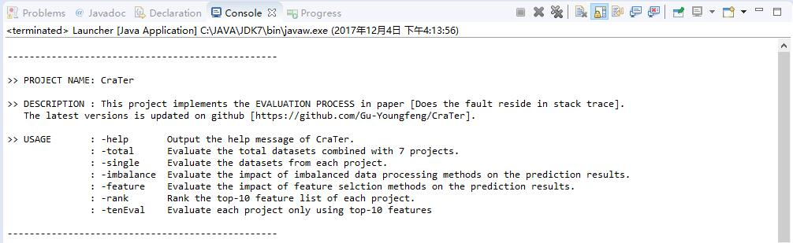
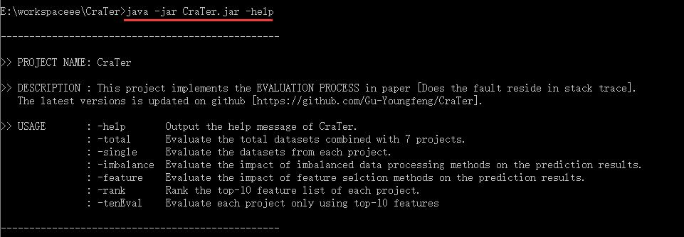

# CraTer

[CraTer](https://github.com/Gu-Youngfeng/CraTer) is an open-source Java tool which implements the **evaluation process** in paper "Does the Fault Reside in Stack Trace". It takes the datasets (arff format) extracted from other Java projects as input, and outputs the evalution results of the prediction approach proposed in the paper. 

## 1. Environment

This project is developed in Java 8.0. The additional plugins we used is **WEKA**, whose jar can be downloaded in the Maven Repository [Weka Stable](http://mvnrepository.com/artifact/nz.ac.waikato.cms.weka/weka-stable).

## 2. Construction

Currently, we have only 3 packages at present, i.e., `sklse.yongfeng.data`, which does some data preprocessing work, `sklse.yongfeng.experiments`, which contains the whole experiments processes, and `sklse.yongfeng.launcher`, which provide the main entry of the project.

`sklse.yongfeng.data` package includes,

- **FilesSearcher.java** provide different file searchers for searching suitable datasets.
- **RandomGenerator.java** is used to randomly select/generate crashes from each project.
- **InsMerge.java** is used to merage individual datasets into one total dataset.
- **StatisticalProject.java** calculates the statistical information(distribution of **inTrace** and **outTrace** instances) of each dataset.

`sklse.yongfeng.experiments` package includes,

- **Overall.java** evaluates the prediction approach on the total datasets combined with 7 projects using cross validation.
- **Single.java** evaluates the prediction approach on each project using cross validation.
- **ImbalanceProcessingAve.java** conducts the contrast experiment between using imbalanced data processing methods and No strategy.
- **FeatureSelectionAve.java** conducts the contrast experiment between using feature selection methods and No strategy.
- **FeatureRankingAve.java** ranks the features by Pearson's Correlation, then output the top-10 feature list of each project.
- **TopTenFeatureEvaluation.java** evaluate the prediction approach on the each project using only top-10 features.
- **FoldResultsAve.java** is used to get each fold result in cross validation, and the results will be used in the Wilcoxon signed-rank test.

`sklse.yongfeng.launcher` package includes,

- **Launcher.java** provides the main entry of the project.

`files` folder includes,

- All dataset used in our experiments.

`libs` folder includes,

- All dependency jar files used in our project.

`CraTer.jar`

- `CraTer.jar` is the core part of the project, we can run it directly on terminate or CMD windows.

## 3. Usage

There are two main way to run the **CraTer** on your computer, and it's also a easy work to conduct secondary development on **CraTer**.

Import the **CraTer project** into Eclipse, there is almost a main function in every java file. Click `run as Java application` to get the experimental results. For example, if we set the arguments of run configuration to `-help`, we will see,

Use the **CraTer.jar** contained in the project. try to use it on terminate or CMD windows. The commands are quite simple, for example, try to type `java -jar CraTer.jar -help` on CMD windows to show the description and help information of the **CraTer** project.

