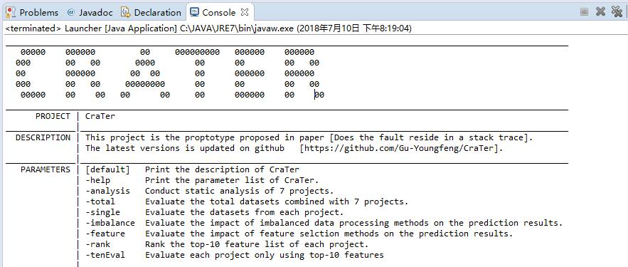
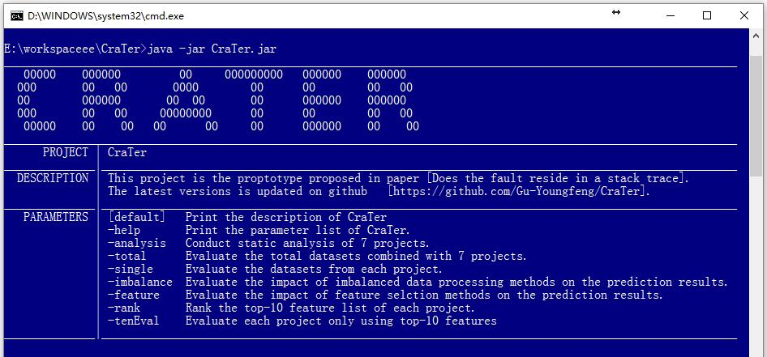

# CraTer

[CraTer](https://github.com/Gu-Youngfeng/CraTer) is a static program analysis tool aims to extract features from buggy **source code** and **stack trace** when a Java program crashed.
CraTer is also the prototype in paper [Does the Fault Reside in a Stack Trace?](2019_JSS_Does the fault reside in a stack trace.pdf). 
It first extracts features from the crash datasets, then uses these features to train a model to predict whether the crashing fault reside in the corresponding stack trace or not.

## 1. Environment

This project is developed on Java 8.0. 
The external libraries we used are **WEKA** and **SPOON**, which can be downloaded in the Maven repository [Weka Stable](http://mvnrepository.com/artifact/nz.ac.waikato.cms.weka/weka-stable) and [Spoon Core](http://mvnrepository.com/artifact/fr.inria.gforge.spoon/spoon-core).

## 2. Construction

Currently, we have only five packages at present, i.e., `sklse.yongfeng.analysis`, which conducts static analysis on method, class, and project, `sklse.yongfeng.data`, which does some data preprocessing work, `sklse.yongfeng.experiments`, which contains the whole experiments processes, and `sklse.yongfeng.launcher`, which provide the main entry of the project.

`sklse.yongfeng.analysis` package includes,

- **Analysis.java** analyzes the 3,500 mutated crash instances from 7 real-world projects.
- **RepsUtilier.java** splits the single crash from stack traces file and analyzes the features from the stack trace.
- **CrashNode** saves detailed information of each crash.
- **MEDAnalyzer.java** analyzes the method-level features. 
- **CLSAnalyzer.java** analyzes the class-level features.
- **SRCAnalyzer.java** analyzes the project-level features.
- **FeatureList.java** describes the detail information of total 89 features we need to extract.

`sklse.yongfeng.analysis.realcrash` package conducts the experiments on real-world crashes, implementing the similar functions with the package `sklse.yongfeng.analysis`.

`sklse.yongfeng.data` package includes,

- **FilesSearcher.java** provide different file searchers for searching suitable datasets.
- **RandomGenerator.java** is used to randomly select/generate crashes from each project.
- **InsMerge.java** is used to merage individual datasets into one total dataset.
- **StatisticalProject.java** calculates the statistical information(distribution of **inTrace** and **outTrace** instances) of each dataset.

`sklse.yongfeng.experiments` package includes,

- **Overall.java** evaluates the prediction approach on the total datasets combined with 7 projects using cross validation.
- **Single.java** evaluates the prediction approach on each project using cross validation.
- **ImbalanceProcessingAve.java** conducts the contrast experiment between using imbalanced data processing methods and No strategy.
- **FeatureSelectionAve.java** conducts the contrast experiment between using feature selection methods and No strategy.
- **FeatureRankingAve.java** ranks the features by Pearson's Correlation, then output the top-10 feature list of each project.
- **TopTenFeatureEvaluation.java** evaluate the prediction approach on the each project using only top-10 features.
- **FoldResultsAve.java** is used to get each fold result in cross validation, and the results will be used in the Wilcoxon signed-rank test.

`sklse.yongfeng.launcher` package includes,

- **Launcher.java** provides the main entry of the project.

Beside the packages presented above, the `CraTer.jar` is the core part of the project, we can run it directly on terminate or CMD windows. What'more, `libs` folder includes all dependency jar files used in our project.`files` folder includes all dataset used in our experiments. `resources/crashrep` collects stack trace files of each project, `resources/projs` saves all source codes of each project, `resources/projs_libs` preserves jar formats of each project.

## 3. Usage

There are two main way to run the **CraTer** on your computer, and it's also a easy work to conduct secondary development on **CraTer**.

**[Method 1]**: Import the **CraTer project** into Eclipse, there is almost a main function in every java file. Click `run as Java application` to get the experimental results. For example, if we set the arguments of run configuration to `-help`, we will see,

**[Method 2]**: Use the **CraTer.jar** contained in the project. try to use it on terminate or CMD windows[^1]. The commands are quite simple, for example, try to type `java -jar CraTer.jar -help` on CMD windows to show the description and help information of the **CraTer** project.

[^1]: when you are running runable jar (CraTer.jar) on CMD windows, make sure that the jar file is in the root directory of project. 

